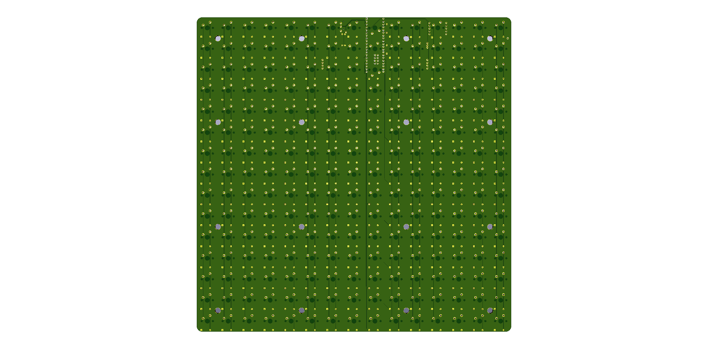

# ScrabblePad

 "scrabblepad.xxx" = Default files using the GB pinout and setup. 
 Alternate files:
	scrabblepad - 6mil_traces - Base board with routed switch and diode matrix, no other components placed. 
	scrabblepad - centered controller - Same pinout and schematic as the GB board before I remembered there were centered standoffs in the JOlimon case. 
	
SVG/DXF files: width should be 285.75mm 

An assembly guide can be found at https://github.com/JonasGe/ScrabblepadAssembly
